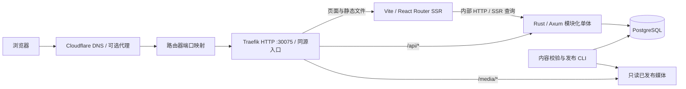

# 系统架构与技术栈

## 架构选择

2026-10-06 已开始工程开发；本文保留整体目标设计，实际实现边界与可运行命令见 [工程说明](08-development.md)。

采用一个仓库、两套工具链：前端 pnpm workspace（Vite 8 + TypeScript 7 + Tailwind CSS 4 + React Router），后端 Cargo workspace（Rust + Axum）。服务端内部按领域组织，是**模块化单体**；业务一致性集中在一个 PostgreSQL 数据库中。

建议 React Router Framework Mode + Vite SSR：Web 的 Node 进程只处理 React 页面渲染、路由 loader 和浏览器资源，Rust API 是唯一业务后端。Vite 提供 SSR 构建/开发能力，生产仍需运行生成的 JS 服务端 bundle；不能让 Rust 直接执行 React SSR。公开目录/课程首屏可 SSR 或预渲染，练习、知识抽屉和进度交互在客户端处理。

前端继续使用 React，暂不引入 Leptos/Yew 等 Rust/WASM UI：当前阅读、文本交互和组件需求更适合用户已经指定的栈。未来若某项计算确实需要 WASM，再局部引入 Rust，不重复维护前端技术体系。



Cloudflare DNS only 时用户连接直接到公网 IP；启用代理时经过 Cloudflare 边缘。路由器、TLS 和 Docker 细节见部署文档。

不增加 Redis、消息队列、Kubernetes、对象存储或独立 CMS。首版单实例 API 用数据库事务解决一致性，媒体保存在持久卷；出现明确需求再扩展。

## 推荐技术栈

资料核对日期为 2026-10-05。表中版本是建议系列/当前资料快照，**不是已安装的依赖**。开发开始时从官方发布记录和 registry 核对稳定版本、peer dependencies、安全修复，再锁定确切版本。生产镜像也锁版本和 digest，不使用 `latest`。

| 部分 | 建议 | 选择依据与边界 |
| --- | --- | --- |
| 运行时 | Rust stable + Node.js 24 LTS（Web SSR） | Rust 工具链锁定在 rust-toolchain.toml；Node 仅用于前端开发/渲染 |
| 语言 | TypeScript 7 + Rust edition 2024 | TS strict；Rust 不使用 nightly；核对 MSRV 和依赖兼容 |
| 包管理 | pnpm 稳定版 + workspace | 单一 lockfile；不为小仓库引入额外任务编排层 |
| Web | Vite 8 + React 19 + React Router 稳定版 | Framework Mode 负责路由/SSR/数据加载；不启用 unstable RSC；Vite 8.1 为已核对的稳定系列更新 |
| UI | Tailwind CSS 4 + shadcn/ui 组件源码 | 自定义产品 token；只引入实际使用的可访问组件 |
| API | Axum + Tokio + tower/tower-http | HTTP、中间件和异步 I/O；领域逻辑独立于 HTTP |
| 数据契约 | Rust Serde 类型 → schemars JSON Schema → TS 类型 | Rust 类型为实现期真源；jsonschema crate 做内容结构校验，Rust 做语义校验；公共 DTO 单独建模 |
| 数据库 | PostgreSQL 18 稳定系列 | 官方支持页当前列 18.6；业务关系用 SQL，课程快照用 JSONB |
| 持久化 | SeaORM 2 稳定系列 + SeaQuery + sea-orm-migration | 用户认可 ORM 方向；关系模型用 Entity/ActiveModel，复杂查询允许显式 SQL；核对整套依赖兼容 |
| 鉴权 | axum-login + tower-sessions + SeaORM SessionStore + Argon2id | 成熟会话/密码基础库；会话存储适配层与 ORM 共用 DB connection/pool |
| 前端请求 | fetch + TanStack Query 稳定版 | SSR 获取初始数据，客户端处理练习和续学；避免双重缓存真源 |
| 状态 | React 局部状态 / reducer | 当前步骤、译文开关和抽屉是 UI 状态；首版无需全局状态库 |
| 日志/接口 | tracing + OpenAPI 3.1 | requestId/错误结构；从 Rust 公共 DTO 导出接口，生成 TS 客户端 |
| 验证 | cargo test + PostgreSQL 集成测试 + Vitest + Playwright | 重点验证课程校验、判分、权限、跨设备和端到端流程 |
| 部署 | Docker Compose + Traefik 稳定版 | 本机 Linux 容器、HTTP 30075 同源入口；TLS 由用户外部处理 |

Vite 8 和 TypeScript 7 已有官方稳定发布资料。TS 7.0 的程序化 compiler API 与旧工具存在兼容边界：类型检查采用 TS 7，lint/类型生成若仍依赖 TS 6 API，则隔离相应兼容工具依赖，而不降级应用的 TS 7 类型检查。Vite build 不代替类型检查；React Router typegen 和插件 peer dependencies 在初始化时实际验证。

“最新”解释为用户选定系列中的当前稳定、活跃维护版本，不使用 nightly。Rust crates 的具体版本、MSRV、Axum/SeaORM/session store 配套版本在开发开始时核对，不机械拼接各自最新版。SeaORM 2.0 已有官方稳定发布记录；开发时以对应版本文档为准，避免混用 1.x 和 2.x 的 Entity 写法。

## 计划目录

```text
apps/
  web/                    # Vite / React Router、课程渲染器、SSR、浏览器交互
crates/
  server/                 # Axum、鉴权、领域服务、SQL、运维 CLI（先用模块组织）
  course-contract/        # Serde 类型、Schema 导出、结构与语义校验、公共 DTO
packages/
  contracts/              # 从 Rust 导出的公共 Schema/TS/OpenAPI，禁止手改生成物
  course-runtime/         # TS 纯函数：步骤解析、锚点索引；无私有投影/数据库
content/
  catalog.json            # 等级/单元/课程顺序与元数据
  lessons/                # 含判题规则的权威课程源，绝不能放进 web/public
  knowledge/              # 词汇、表达、语法的共享编辑源
  media-manifest.json     # 媒体 ID、哈希、尺寸、授权、署名
infra/                    # Dockerfile、Compose、Traefik 配置、备份说明
docs/                     # 当前已有设计与示例；应用目录尚未创建
Cargo.toml / Cargo.lock   # Rust workspace / 可重复构建
pnpm-workspace.yaml       # 前端 workspace，独立 pnpm-lock.yaml
rust-toolchain.toml       # 固定 stable 工具链与 rustfmt/clippy
```

Rust/TS 之间共享**生成的数据契约**，不假装能直接共享源代码。数据库 schema、认证、私有课程投影和判题模块留在 Rust server；web 不读取秘密或带答案课程源。服务端先用模块组织，只有契约 crate 需要独立导出。前端 packages 只放确实复用的契约/纯 UI 逻辑；不先拆一套庞大 crate/package 架构。

Schema 草案是设计期契约。实现期使用 Serde 带 `type`/`kind` 标签的枚举（例如 `#[serde(tag = "type")]`），将其与独立公共 DTO 建为真源，导出 schemars Schema，生成 TS discriminated unions；与设计快照做一致性检查。不能在 Rust、Schema、TS 三处维护三套手写定义。生成器若不支持某项 JSON Schema，先约束可导出的契约子集并验证，不靠手改输出补洞。

完整的课程源 Schema（包含 grading）只供 Rust 内容工具和编辑校验使用；Web 的 contracts 包只能导出 PublicLesson/公共 API 类型及对应 Schema，不能从完整模型通过 TS Omit 来假装建立安全边界。实现生成流程后，CI 检查导出差异并拒绝手改生成物。

## 服务端领域边界

| 模块 | 职责 | 主要记录 |
| --- | --- | --- |
| identity | 会话、邀请、角色、个人设置 | users、sessions、invites、reset_tokens、user_settings |
| catalog | 三级目录、发布版本、公共课程快照 | levels、units、lessons、lesson_revisions |
| learning | 学习会话、进度、提交、完成 | learning_sessions、step_progress、exercise_attempts、lesson_progress |
| review | 收藏、到期表达、复习提交 | saved_items、review_cards、review_attempts |
| publishing | 校验、导入、发布、撤回、审计 | content_releases、release_entries、publish_audit |

HTTP handler 只做输入解析、调用领域服务、响应投影；鉴权和事务在服务端执行。前端不能通过提交 `userId`、分数或完成状态改变权限/判题结果。

## 数据库概念模型

- `levels` / `units` / `lessons`：稳定 ID、所属父级；顺序及发布展示数据通过 release entries 固化，URL slug 可修改且保留旧链接跳转。
- `lesson_revisions`：`(lesson_id, revision)` 唯一、schema_version、内容哈希、server_document JSONB、public_document JSONB、创建时间；发布后不可原位修改。
- `content_releases` / `release_entries`：完整课程目录快照、课程 revision 映射、状态；数据库中一个 active release 指针，事务切换。
- `learning_sessions`：用户、lesson_id、固定 revision、客户端支持的 schema 版本、last_step_id、状态、乐观锁 version。
- `step_progress`：`(session_id, step_id)` 唯一，confirmed_at；确认动作可重复调用。
- `exercise_attempts`：用户、会话、题 ID、答案、服务端结果、提示标记、attempt_index、幂等键、时间；首次与重试都保留。
- `lesson_progress`：`(user_id, lesson_id)` 唯一，last_session_id、首次完成时间、最近完成 revision；课程更新不抹去历史完成。
- `saved_items`：`(user_id, knowledge_id)` 唯一，类型、首次来源、是否收藏；收藏和参加复习可独立操作。
- `review_cards`：`(user_id, knowledge_id)` 唯一，知识快照/版本、来源 revision、档位、due_at、version；同一语块不因多课出现创建重复卡。
- `review_attempts`：卡 ID、幂等键、用户自评、旧/新档位、提交时间；事务更新卡片。
- 时间保存为 PostgreSQL `timestamptz`；学习日界线根据用户 IANA 时区计算，不由服务器时区决定。

SQL FK/唯一约束保证关系；JSON 内的锚点和流程引用由发布校验保证。所有用户数据查询先固定当前用户，避免对象 ID 枚举导致跨用户读取。

SeaORM Entity 对应持久化表，API 公共 DTO 和课程 AST 独立于 ORM；不把 Entity/ActiveModel 直接序列化给浏览器，也不将请求字段无筛选映射到 ActiveModel。进度、幂等、邀请消费和 release 切换使用同一个 DatabaseTransaction；需要锁的操作显式定义锁/隔离级别或版本条件，不假定 ORM 自动解决并发。

先用 SeaORM 的批量查询/关系加载，避免目录和复习的 N+1；只有真实瓶颈才增加 raw SQL。迁移使用 sea-orm-migration，版本记录和实际 DDL 可审查；即使有 entity-first/schema sync 功能，生产也不在启动时自动同步 Entity 到数据库。集成测试使用真实 PostgreSQL，mock 不替代 JSONB、唯一约束和事务验证。

## 请求与鉴权

对浏览器始终只有一个 origin：生产为用户配置的外部地址，开发为 `http://localhost:5173`。Traefik HTTP 入口通过宿主机 30075 接收流量，将 `/api/*` 保留完整前缀转给 Rust server，其余页面交由 Web SSR。HTTPS 由用户外部处理。开发由 Vite server.proxy 代理至 `127.0.0.1:3001`；strictPort 防止自动切端口后 trusted origin 失配。

React Router server loader 调用 `INTERNAL_API_URL`。公共目录可以按 release ID 缓存；涉及用户的 SSR 请求显式转发该请求的 session cookie，Rust 重新验证会话；HTML、loader data 和 API 响应 `private, no-store`，不进入共享/Cloudflare 缓存。只转发明确需要的 cookie 和受信 header，不转发浏览器伪造的代理身份。登录/退出/邀请通过浏览器同源 `/api/v1/auth/*`，Set-Cookie 由反向代理透传。

生产使用 HttpOnly、Secure、SameSite=Lax cookie，不将会话 token 写进 localStorage。tower-sessions 用 SeaORM PostgreSQL SessionStore，axum-login 管理登录态；cookie 生命周期、session ID 轮换、到期清理和撤销均显式配置。用户 session auth hash 随密码重置更新，以废止旧会话；身份中间件不等于业务访问控制。

现有 `tower-sessions-seaorm-store` 可作为候选，尚未证明它与选定 SeaORM 2/session 版本兼容。实现身份模块时先检查依赖并跑存取/过期/并发验证；若不兼容，只按 tower-sessions 的 SessionStore trait 实现薄 SeaORM 存储适配层，复用成熟会话机制，不为此另建 SQLx connection pool 或改造会话协议。

所有写接口校验 Origin + 服务端签发的会话绑定 CSRF token（自定义 header）；登录前先建立临时会话并获取 CSRF token，登录成功轮换 session 与 token。认证库基础组件不被假定自动提供所有 CSRF 防护。不要只根据 SameSite cookie 宣称已解决 CSRF。所有用户输入经过严格 Serde/业务校验，输出使用独立公共 DTO；正文不接受任意 HTML。

首版角色为 learner/operator。初次上线关闭开放注册，operator CLI 生成一次性邀请，用户设置自己的密码。邀请/重置 token 使用密码学安全随机数、只存哈希、限时限次，事务消费。密码通过 RustCrypto Argon2id 哈希，盐独立随机，成本参数在部署机器上测量；计算放进有并发限制的 spawn_blocking，避免阻塞 Tokio 或耗尽资源。登录限流、统一错误、session fixation 防护和退出撤销必须验证。

SMTP 尚未配置时不提供会发信的假按钮，恢复通过本机 operator CLI 生成短效重置链接，消费后撤销旧会话。CLI 是本机维护工具，不在公网提供 operator 密码重置 API。开放注册前补齐邮件验证、自助恢复和相应滥用控制。

## API 草案

业务和认证路由统一 `/api/v1`。下表为契约设计，并未实现。

| 方法与路径 | 用途与关键行为 |
| --- | --- |
| GET `/auth/csrf` | 建立/使用临时会话，返回会话绑定 CSRF token；no-store |
| POST `/auth/login` / `/auth/logout` | 登录轮换 session/token；退出撤销会话；CSRF/Origin/限流 |
| POST `/auth/accept-invite` | 一次性 token + 邮箱 + 密码；事务消费并建立用户 |
| POST `/auth/reset-password` | 一次性重置 token + 新密码；消费、更新 hash、撤销旧会话 |
| GET `/catalog` | active release 的等级、单元、课程摘要；允许访客 |
| GET `/lessons/:id` | 返回当前已发布公共课程 DTO；绝不含判题键 |
| GET `/me` | 当前用户与学习设置；无会话返回 401 |
| PATCH `/me/settings` | 时区、学习目标、译文偏好；字段 allowlist |
| POST `/learning-sessions` | lessonId；建立固定 revision 会话，返回 session 公共数据 |
| GET `/learning-sessions/:id` | 本人的课程快照、进度、可用题目；已撤回敏感内容返回 410 |
| PUT `/learning-sessions/:id/steps/:stepId` | 幂等确认步骤；验证当前版本和前置条件 |
| POST `/learning-sessions/:id/attempts` | exerciseId + answer + idempotency key；判分、记录并返回本题反馈 |
| POST `/learning-sessions/:id/complete` | 服务端检查 completion policy；幂等完成、创建复习卡 |
| GET `/me/learning` | 最近会话与课程状态；分页 |
| PUT / DELETE `/me/saved-items/:knowledgeId` | 幂等收藏/取消；知识 ID 必须来自已发布内容 |
| GET `/me/reviews?date=...` | 按用户时区获取到期卡；受限数量、按到期时间排序 |
| POST `/me/reviews/:id/attempts` | 自评 + cardVersion + idempotency key；事务推进档位 |

公用错误结构：`{ error: { code, message, requestId, details? } }`。输入错误 400，未登录 401，无权 403（敏感对象可返回 404），内容撤回 410，版本冲突 409，限流 429。details 不输出堆栈、SQL 或秘密。

幂等键按用户和接口 scope 唯一；相同键相同请求返回第一次结果，不同 payload 返回 409。幂等记录与业务写入在同一事务完成。练习重试用新键记录新 attempt，网络重发用原键。session/card version 解决两标签页同时写入；冲突后客户端刷新状态，不用“最后写入覆盖”损失进度。

## 课程解释器和前端状态

运行流程是 `JSON → 结构校验 → 语义校验 → 发布快照 → 公共投影 → 组件注册表 → 学习流程 reducer`。renderer registry 按 `block.type` 渲染，flow 按步骤引用 block IDs。语法解释本身是内容；程序不在课程中执行代码。

SSR 负责页面壳和首屏，客户端负责译文、点词、音频、练习与续学。React Router loader 提供初始数据，客户端 TanStack Query 处理高交互服务端状态；用同一 query key/显式 hydration，避免 loader 和 Query 各自产生不同的私有数据真源。切换用户清理私有缓存。切换步骤立即展示本地状态，同时显示保存状态；失败保留当前内容和明确的“未保存”，以原幂等键重试。

Web only 采用响应式页面，不提供完整离线学习。断网可继续看已加载内容，但服务器未确认的步骤不标为已保存；初版只在当前标签页内存保存待提交操作，不把私有答案/会话持久化到共享浏览器存储。刷新可能丢失尚未成功发送的操作，界面须提示。

## 复习算法 v1

固定间隔档位 `[1, 3, 7, 14, 30]`，另有 initial 状态。用户自评不会/会/熟悉分别重置首档、前进一档、前进两档；初次回答会或熟悉分别进入首档/第二档。按学习时区计算目标本地日期的 09:00 后转换 UTC `due_at`；改时区保留已排 UTC 到期时间，后续提交按新时区排期。

每天推荐到期队列最早的 10 项，用户可继续下一批，不会因为漏学累积无限长的必做任务。首版将自评复习与练习正确率分开；将来若引入 FSRS，保存算法版本和迁移依据，不能把固定档位包装成自适应记忆模型。

## 可观测与性能目标

tracing 日志是结构化 JSON，含 requestId、route、duration、error code；密码、cookie、邀请/重置 token 和完整用户答案不进日志。记录内容发布和运维变更审计。API 提供内部 liveness/readiness，readiness 验证 DB 可用和必需 migrations；健康细节不直接开放公网。

Rust 特有的边界：限制 body 大小、数据库 pool、查询超时、密码哈希并发和内容解析资源；不在 async handler 做重 CPU 同步工作。应用层使用明确错误类型，将内部错误映射到统一 API code。SeaORM 迁移和查询在临时 PostgreSQL 验证；不能只靠 cargo check 宣称关系、SQL 和事务实际可用。底层 SQLx 由 ORM 配套依赖管理，除必要场景不独立采用第二套查询体系。服务优雅关闭请求、pool 和会话清理任务。

首版假设 1–20 个同时活跃用户，使用真实正文与媒体做小规模压测再定容量。体验目标：常规手机网络首屏 LCP < 2.5 秒，常用 API 本机 p95 < 300ms（不含外网延迟）；这是待验证目标，不是已测结果。

## 官方资料

- [Node.js 发布状态](https://nodejs.org/en/about/previous-releases)
- [Vite 8](https://vite.dev/blog/announcing-vite8)、[Vite 8.1](https://vite.dev/blog/announcing-vite8-1)、[Vite SSR](https://vite.dev/guide/ssr)
- [React Router 渲染策略](https://reactrouter.com/start/framework/rendering)、[部署](https://reactrouter.com/start/framework/deploying)
- [React 版本](https://react.dev/versions)、[TypeScript 7.0 发布与工具兼容](https://devblogs.microsoft.com/typescript/announcing-typescript-7-0/)
- [Axum](https://docs.rs/axum/latest/axum/)、[SeaORM 官方发布](https://github.com/SeaQL/sea-orm/releases)、[SeaORM 文档](https://www.sea-ql.org/SeaORM/docs/index/)、[schemars](https://docs.rs/crate/schemars/latest)
- [SeaORM 会话存储候选](https://docs.rs/tower-sessions-seaorm-store/latest/tower_sessions_seaorm_store/)
- [axum-login](https://docs.rs/axum-login/latest/axum_login/)、[tower-sessions](https://docs.rs/tower-sessions/latest/tower_sessions/)、[Argon2](https://docs.rs/argon2/latest/argon2/)
- [PostgreSQL 版本支持](https://www.postgresql.org/support/versioning/)
- [Tailwind CSS 4](https://tailwindcss.com/blog/tailwindcss-v4)
