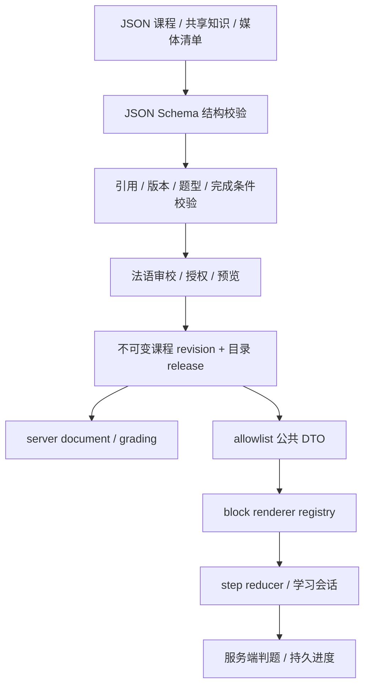

# 课程解释器与数据契约

## 数据与行为分离

课程是声明式数据。文章/对话是正文，词汇和语法通过稳定 ID 关联正文，block 描述可展示的内容，step 描述学习顺序。解释器由白名单注册表处理已知类型，不允许课程携带 JavaScript、JSX、MDX、任意 HTML 或动态组件路径。

新增常规课程只写数据；引入全新题型或交互才需要修改 Schema、解释器、服务端与 renderer。

## 契约层次

1. **编辑源**：`content/` 中的 JSON 和知识库，可以是 draft；版本控制适合审校差异。
2. **规范化课程**：发布工具将共享知识解析成课程内的固定快照；v1 的源文件也允许直接嵌入知识声明。离开当前课程不影响它的历史解释。
3. **服务端文档**：完整规范化正文 + `serverOnly.grading`，仅后端保存。
4. **公共 DTO**：从允许字段重新构造，排除 `serverOnly` 和编辑备注；禁止通过只删除一个字段后原样转发来防泄漏。
5. **学习状态**：单独存用户会话、提交和复习，不写回课程。

[示例 JSON](examples/a1-bakery.lesson.json) 与 [Schema 草案](examples/lesson.schema.json) 描述规范化文档 v0.1。示例是 draft，插图引用尚待制作、法语尚待人工审校；通过结构校验并不等于允许发布。实现时在 Rust `crates/course-contract` 中定义 Serde/Schema 类型，再导出公共 Schema/TS 到 `packages/contracts`；此处保存设计快照，不能长期手写两份契约。

## 字段与版本

| 字段 | 用途 |
| --- | --- |
| schemaVersion | 数据语言版本，例如 `1.0`；与课程内容版本分开 |
| id / revision | 稳定课程 ID + 递增内容版本；已发布二者组合不可变 |
| levelId / unitId | 指向三级目录的父级；目录校验其一致性 |
| title / summaryZh | 法语/中文题名和中文简介 |
| estimatedMinutes / objectivesZh | 学习时长建议和能做到什么 |
| knowledge | 已解析的词汇/表达与语法快照 |
| blocks | 内容节点，按 type 判别 |
| steps | 有序流程，每个步骤引用一个或多个 block |
| completion | 必须确认的步骤、必须提交的题目，策略 v1 为 attempt-all |
| reviewItemIds | 完成后进入复习的目标词汇/表达 ID，不是全部生词 |
| serverOnly.grading | 题目与服务器判分规则；只存在服务端文档 |
| editorial | draft/reviewed 状态及编辑备注，不进入公共 DTO |

稳定 ID 使用可读 ASCII 标识，例如 `a1-bakery-buy-breakfast`、`expr-je-voudrais`。lesson/knowledge ID 全局稳定；block、step、正文 entry 和 segment ID 在课程内稳定。改标题、顺序或措辞时保留含义相同的 ID；语义完全变更则新建 ID，避免将旧练习提交挂到新题目。

schemaVersion 的 major 变化表示旧解释器不能处理；minor 变化只允许兼容新增，仍须通过能力协商。未知字段在当前 Schema 中拒绝，客户端不自行猜测新版。服务端返回 supported schema/capabilities，无法渲染时保留进度并提示刷新/升级，不静默跳过必做内容。

## 正文、锚点与知识关联

文章包含 paragraph，dialogue 包含 speaker 和 turn，两者的正文都使用 `segments`。每个 segment 是**原样文本**，可携带 vocabularyId/grammarId；空格和标点也在文本中，按顺序拼接才是原句。

例：`Je voudrais`、` une `、`baguette`、`, s’il vous plaît.`。点击第一段打开礼貌请求解释，点击第三段打开词汇；多个词组成的表达可用一个 segment 表示，不强制“一词一 token”。

解释的 target 为 `{ blockId, entryId, segmentId? }`，entryId 指 turn 或 paragraph；省略 segmentId 时关联整句/段。结构化锚点避开字符偏移的 Unicode、撇号、空格和改文问题。保存正文采用 NFC；发布校验必须确认引用存在，而且 segment 确实属于对应 entry 和 block。

每个正文 entry 有 `translationZh`，不是逐词机械翻译。译文默认隐藏，对话点击头像展开当前话语译文，全局默认由设置页控制；它是学习资料，不是题目判分数据。链接到知识库的意义和使用范围应人工审核。

## v1 节点类型

| type | 主要字段 | 渲染行为 |
| --- | --- | --- |
| scene | placeZh、situationZh、illustrationId? | 交代角色/地点/目标，显示情境插图 |
| dialogue | titleZh、speakers、turns | 保持轮次，支持点击语块、译文、未来音频 |
| article | titleZh、paragraphs | 连贯阅读，不把每个句子都拆成聊天气泡 |
| explanation | titleZh、bodyZh、targets | 句子解释，随锚点或在知识区查看 |
| culture | titleZh、bodyZh、scopeZh | 指明适用地区/场景，解释日常习惯与差异 |
| vocabulary | entryIds | 目标词汇/表达列表，关联发音、收藏和复习 |
| grammar | entryIds | 核心语法点、原文例句和短解释 |
| exercise | exerciseType、promptZh、题型字段 | 单选、单空填空或排序 |
| habit | taskZh、alternativeZh | 可选现实任务；提供适用于非在法生活者的替代 |
| summary | takeawaysZh | 回到能做什么，完成课程 |

scene/reference/media 不是独立课程层级。解释、文化说明可在侧栏出现，也可在 explore 步骤单独展示；不要把每个 block 都强制做成一个“下一页”。

词汇条目包括 id、lemma、partOfSpeech、meaningZh、noteZh，可选 gender。常用语块的 partOfSpeech 可以是 phrase，不伪造它是单一词性。语法条目包括 id、titleZh、bodyZh、examples。共享知识原始文件可有更多编辑元数据，发布规范化后只留下需要的字段。

## 流程语义

steps 是数组，顺序就是推荐学习顺序；kind 为 discover/read/explore/practice/apply/recap。blockIds 只引用同课节点，允许一个步骤组合正文与说明。

v1 只做线性流程。用户可以回到已访问步骤、预览目录和退出；完成校验由 completion 决定。习惯任务可略过。exercise block 只进入 practice，避免在阅读区泄露判题反馈。

必做步骤确认条件：read 由用户明确点击“读完了”；practice 需提交该步骤所有必做题；recap 确认总结。服务端验证条件，再保存确认。completion.requiredExerciseIds 必须属于必做 practice 步骤，且每个 exercise 都有判分规则。

`attempt-all` 表示所有必做题至少一次有效提交即可完成。错题可重试，结果保留；得分不强制卡住生活学习流程。正文中本就可能出现答案，不把“隐藏判题键”当作考试级反作弊措施。

## 判题规则

| 题型 | 学员提交 | serverOnly.grading |
| --- | --- | --- |
| single-choice | optionId | `kind: choice` + correctOptionId + feedbackZh |
| fill-blank | text | `kind: text` + accepted 数组 + caseSensitive + feedbackZh |
| order | tokenIds 数组 | `kind: order` + correctTokenIds + feedbackZh |

填空 v1 只支持一个空，避免在未设计多空反馈前偷加约定。字符串比较先 NFC、首尾 trim、连续空白合并、弯撇号统一，再按 caseSensitive 比较；保留重音和连字符。可接受的变体在 accepted 中显式列出。排序以 token ID 校验重复/缺失与顺序，不靠显示字符串拼接判定。

普通重试保存不同 attempt；网络重发返回同一结果。服务端只给已提交的题目返回反馈/正确形式，不返回整课判题集合。公开 hintZh 不属于答案键；usedHint 是 UX 记录，浏览器可以伪造，不用于认证/高风险评分。

## 发布校验

当前稳定标识规则与目录发布、媒体登记及客户端保存恢复一致：1–100 个 ASCII 字母、数字、`-` 或 `_`。课程/等级/单元、知识、块/步骤、正文条目/语块、角色/头像、题目选项/token 与媒体定义使用同一服务端校验；引用另需存在并匹配其命名空间。这个约束仅用于机器标识，不限制法语/中文显示文本。早期 `examples/lesson.schema.json` 的小写 slug/120 字符模式属于 v0.1 草案；当前作者类型契约见 `generated/author-lesson.schema.json`，标识字符/长度及其他语义规则由共享 Rust 校验执行。

当前公共课程语义校验要求标题、简介、学习目标、场景描述、正文中文译文、角色标签、词汇的词形/词性/中文释义、语法标题/正文及已有例句的双语文本、解释正文、文化说明与适用范围、生活任务及替代任务、回顾要点均非空白。学习目标和回顾要点至少一项，建议时长为 1–60 分钟；Unicode 空白同样视为空。词汇额外备注、提示与未提供的语法例句不因此变成必填内容。`check` 和最终导入/发布投影复用同一校验，错误指向具体字段；这些检查只证明教学字段齐备，不证明法语、译文或教学难度已经人工审校。

结构校验采用严格 JSON Schema，Rust jsonschema crate 校验，Serde 反序列化后做语义校验；语义校验与结构校验分开，错误包含文件、JSON pointer、错误码和可读描述。公共 Serde DTO 独立定义，字段严格；课程源的重复 JSON key 由专门的源解析检查拒绝。

- ID 在各自命名空间唯一；不存在重复 JSON key（源解析器需检测，普通 JSON.parse 会覆盖重复 key）。
- level/unit 关系有效，catalog 的课程映射及顺序有效。
- step、block、entry、segment、knowledge 引用存在且类型匹配。
- speakerId 指向该对话内角色，正文拼接非空，翻译字段非空。
- 所有 blocks 均可被 steps 访问，所有必做步骤/题目有效；流程不能形成循环（v1 数组本身无分支）。
- 每道题有且只有一条兼容判分规则；choice 答案在 options 中、order 包含全部且唯一的 tokens、填空 accepted 非空。
- reviewItemIds 指向当前知识快照中的 vocabulary/phrase，不将整套语法说明做成词卡。
- 插图/音频引用可在媒体清单解析，文件哈希、类型、尺寸有效；status planned 不可发布。
- 若启用逐句音频，所有区间都在音频时长内、start < end；缺音频时不生成无法播放的按钮。
- 必需中文解释、学习目标和版权信息齐备；编辑状态已 reviewed，记录人工审校。
- 生成 public DTO 后再次校验，并检查 serverOnly、correctOptionId、accepted、correctTokenIds 不出现在公共 Schema 的答案位置。

字段名扫描是辅助验证，不能替代公共 DTO allowlist。公共正文自然出现“正确答案”中的同一句话是允许的。

## 版本、发布与撤回

编辑 → 校验 → 法语/文化审校 → 生成新 revision → 导入 staging release → 预览 → 事务切换 active release。整批发布失败就不切换，浏览器不会看到一半新目录、一半旧课程。

正文、译文、解释、题目答案或素材变化都生成新的 revision；媒体按内容哈希保存。公共 DTO 与私有规则来自同一个 revision，不能一个更新一个留旧。

新会话用 active release 指向的 revision；进行中的会话固定原 revision。普通新版不强迫重学、不抹去已有完成状态；可以展示“内容已更新”。如确需重新评估掌握，建立新的目标或显式迁移规则。

普通下架停止新建会话，旧会话仍可读取其快照。涉及严重内容错误/版权问题的硬撤回会阻断旧会话（410），保留学习历史但停止该内容复习卡；界面提供返回目录入口。旧 revision 和引用素材按保留政策清理，不能直接删除仍被会话/复习引用的对象。

发布回滚是 active release 切回之前版本；已经开始的新 revision 会话仍保留。新增 block 类型必须先部署兼容解释器，再发布课程。数据库 migrations 与课程 schema migrations 是不同工作，均需显式版本和回滚/兼容策略。

## 角色库与朗读（设计补充）

[角色库示例](examples/characters.json) 维护 character ID、姓名、头像 asset ID 与语音 locale。Camille、Luc、Léa 可跨课复用；“顾客/店员/旁白”属于当次场景的身份，不作为角色主键。示例头像路径仅供概念稿使用，正式课程通过媒体 manifest 解析 avatar ID。

发布时复制选用角色到课程 `cast` 快照，包含 characterId、revision、displayName、avatarId、speechLocale。对话 speaker 引用 characterId，文章引用 narratorId，必须可在快照中解析；更新角色库不能改变已发布课程姓名、头像或配音。正式语音资产可额外固定 voice asset ID。本阶段尚未发布，Schema 1.0 草案中新增 cast 不表示已支持正式兼容迁移。

朗读单位与 block/entry/segment 的稳定 ID 绑定，完整文本按 segments 原序拼接；不可逐词拼接丢失空格、标点和省音。单词点击只读所点词，表达释义可覆盖多个词。对话角色介绍集中在正文前，头像展开译文并读当前轮话语；短文正文不显示角色或头像，段落可有多个句子，正式播放器按审校句子边界和录音片段顺序播放。全篇使用相同队列协调器，旧请求与延迟回调不得覆盖新请求。音频不可用不改变课程完成判定。

正常版采用媒体 manifest 的审校音频与可选时间标注，未配置时不伪造同步；浏览器 TTS 为概念稿演示，其设备声音可用性和 boundary 事件不能当作统一跨设备保证。

### 已接入的录音契约（尚未接通播放）

公共课程可选 `audio` 与 `audioTracks`，为空时不序列化，保留原有不可变课程文档形状。AudioAsset 包含固定 ID/revision、SHA-256、MP3/WAV MIME、durationMs、creditZh 和同源内容哈希 URL；当前限定单文件最长 30 分钟，登记与发布时均以实际解码核对时长。

AudioTrack 将一份录音绑定到 dialogue/article block；cues 使用 entryId、可选 segmentId、可选 wordRange 和 startMs/endMs。整篇录音需要覆盖该正文的每个 entry，按正文顺序排列且整句区间不重叠；语块区间位于整句区间内，单词区间必须有对应语块区间且位于其中。wordRange 使用 segment.text 的 **Unicode scalar** 起止偏移（左闭右开），不使用 JavaScript UTF-16 索引；例如 `🥐 Bonjour` 的 Bonjour 是 [2,9)，转换时不能把 emoji 当作一个 UTF-16 code unit。

Rust 校验音频/正文引用、重复目标、时间区间、父子范围和单词边界，Schema/TS 从 DTO 生成。录音登记使用 `audio-import`：原始来源、授权、创作者和确认状态保存在私有不可变记录中；`audioRefs` 固定素材 ID/revision，由导入工具填充公共 `audio` 描述。`audio-check` 与发布校验使用 [Symphonia 0.6.1](https://docs.rs/symphonia/0.6.1/symphonia/) 完整解码，按实际样本帧核对时长；发布还比较已登记描述与磁盘哈希，拒绝伪造/缺失/损坏录音。公开 `/api/audio` 仅提供已发布且未撤回课程引用的素材，管理员预览使用课程范围内的私有 URL，两者支持有界单段 Range 请求。

前端现优先选用正文的固定录音：头像选择整句 cue；点词将 Intl.Segmenter 的 UTF-16 偏移转换为 Unicode scalar 后精确匹配 wordRange。无单词 cue 时仅合成该词，不扩大为整句。全文将同源录音的所有整句区间合成一次连续播放，保留真实停顿，按媒体 currentTime 更新进度/句子/可选单词高亮；缺少单词时间标注不伪造高亮。播放标识包含课程/revision/block/entry/segment，避免不同正文复用相同 segment ID 时串联。录音调速保持 currentTime，暂停/恢复保持位置。单个 Audio 元素复用，监听/播放 Promise/帧回调均受 generation 约束；正文卸载、路由/预览版本切换与身份改变会取消播放。文件失败时有法语设备声音则转 TTS，否则 toast 并停止；自动播放权限拒绝提示再次点击。HTMLMediaElement 时间与定时边界用于片段控制，浏览器量化/调度不提供样本级剪辑保证。参考 [currentTime](https://developer.mozilla.org/en-US/docs/Web/API/HTMLMediaElement/currentTime)、[WebKit 用户手势策略](https://webkit.org/blog/6784/new-video-policies-for-ios/)。完整私有预览前端、真实 iPhone 与有声音设备上的回退继续验收。

